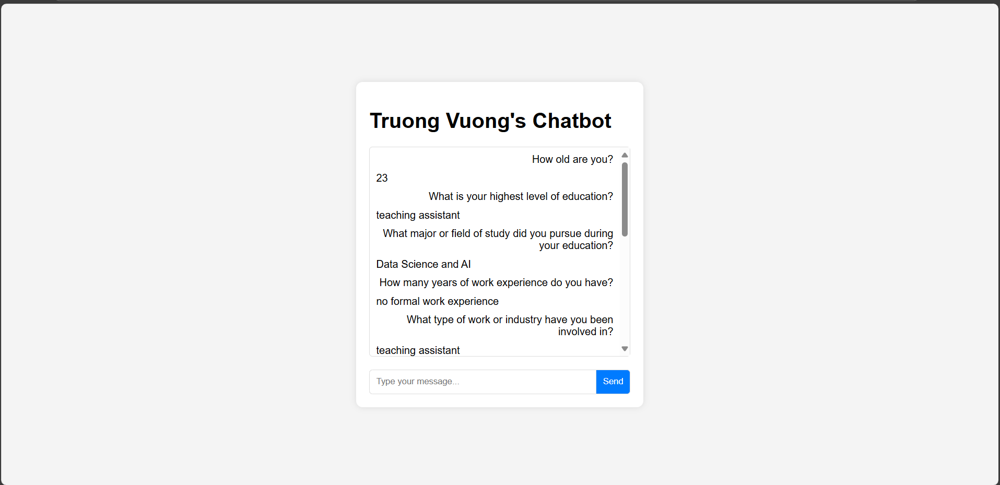
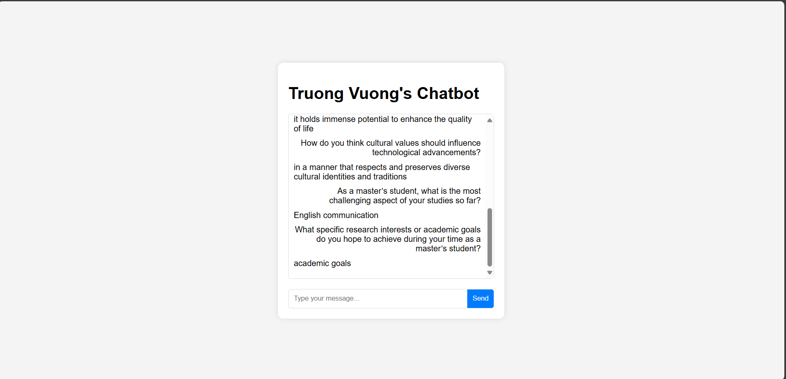

# Task 1: Source Discovery

## Documents

My name is Vuong Loc Truong, and I am a Vietnamese citizen. Born on October 20, 2001, now I'm 23, I am currently pursuing a Master's degree in Data Science and AI, marking my highest level of education thus far. My academic journey has been focused on the intricacies of data and artificial intelligence, a field I find both challenging and profoundly rewarding. While I currently have no formal years of work experience, my involvement in web development has provided me with practical insights into the technological landscape. Presently, I serve as a teaching assistant at Van Lang University, where I contribute to the educational development of students.

My core belief regarding the role of technology in shaping society is that it holds immense potential to enhance the quality of life. By providing solutions to complex problems in healthcare, education, and environmental sustainability, technology can be a powerful force for good. However, I also recognize the importance of ensuring equitable access and addressing ethical concerns to prevent the exacerbation of existing inequalities. Responsible innovation and thoughtful regulation are crucial for harnessing technology’s power for the greater good.

Furthermore, I believe that cultural values should significantly influence technological advancements. Technology should be developed and implemented in a manner that respects and preserves diverse cultural identities and traditions. Avoiding the imposition of a single cultural perspective is essential. Instead, prioritizing inclusivity and adaptability to different cultural contexts ensures that technology serves the needs of diverse communities and promotes cultural understanding.

As a Master's student, I find that the most challenging aspect of my studies thus far is English communication. Overcoming this obstacle is a priority for me. My primary academic goal is to graduate on time, ensuring that I can effectively apply my knowledge and contribute to the field of Data Science and AI. I am dedicated to my studies and eager to see how my research interests will evolve and contribute to the technological advancements of the future.

In addition to my academic pursuits, I have a strong interest in web development. This interest has led me to work on various projects, both personal and academic, that involve creating and maintaining websites. My experience in web development has provided me with a solid understanding of front-end and back-end technologies, as well as the importance of user experience and accessibility. I believe that web development is a crucial skill in today's digital age, and I am committed to continuing my growth in this area.

At Van Lang University, I have had the opportunity to work closely with students as a teaching assistant. This role has allowed me to develop my communication and mentoring skills, as well as gain a deeper understanding of the educational process. I take great pride in helping students achieve their academic goals and am always looking for ways to improve my teaching methods.

Looking ahead, I am excited about the potential for technology to drive positive change in society. I am particularly interested in exploring how data science and artificial intelligence can be used to address pressing global challenges, such as climate change, healthcare, and education. I am committed to using my skills and knowledge to contribute to these efforts and to make a meaningful impact on the world.

## Designed Prompt Template for Chatbot
prompt_template = PromptTemplate(
    input_variables=["context", "question"],
    template="""You are an AI assistant providing precise and concise answers about Vuong Loc Truong.
    Context: {context}
    Question: {question}
    Answer:
    """
)

## Potential Models

- **OpenAI GPT-3**: A powerful text-generation model that can generate high-quality responses.
- **Groq's llama3-70b**: A large language model with limited request capacity but promising capabilities.
- **HuggingFace Models**: Various models available on the HuggingFace platform, such as BERT, T5, etc.

## Task 2: Analysis and Problem Solving

### List of Retriever and Generator Models Utilized

#### Retriever Models
- **FAISS with SentenceTransformerEmbeddings**

#### Generator Models
- **DistilBERT QA model**
- **HuggingFace GPT-2**

### Analysis of Issues Related to Models Providing Unrelated Information

#### Retriever Model Issues
- **FAISS with SentenceTransformerEmbeddings**:
  - Potential for retrieving unrelated documents due to embedding distance inaccuracies.
  - Embedding model may not capture all nuances of the document content, leading to less accurate retrieval results.

#### Generator Model Issues
- **DistilBERT QA model**:
  - Potential for generating unrelated or inaccurate information due to the model's generalization capabilities.
  - Model may produce hallucinations or irrelevant responses if the prompt is not clear or the context is insufficient.
  - Limited ability to accurately generate highly specific or detailed answers without precise prompts.

- **HuggingFace GPT-2**:
  - Similar issues as the DistilBERT QA model, including potential for generating unrelated or inaccurate information.
  - Model may produce less accurate or less specific answers compared to more advanced models like GPT-3.

By understanding these issues, we can take steps to mitigate them, such as refining the retriever model, enhancing the prompt design, or using more advanced text-generation models like OpenAI's GPT-3 or Groq's llama3-70b.